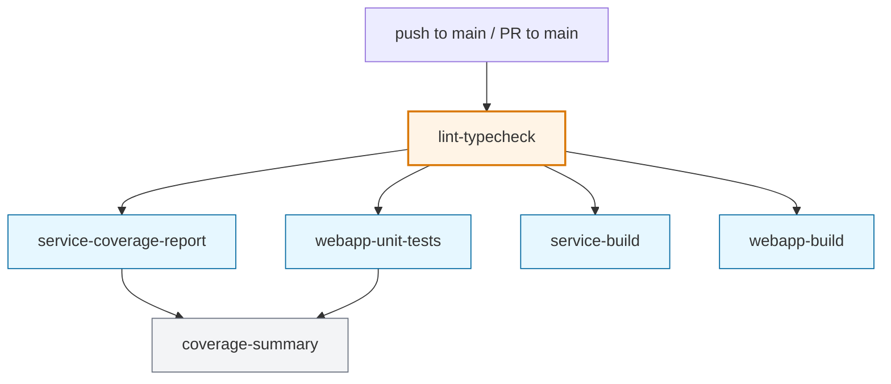

# CI Workflow and Quality Gates

This document describes the GitHub Actions workflow that runs on every push to
`main` and every pull request targeting `main`, the eight quality gates that
fire inside the early `lint-typecheck` job, and the GitHub branch-protection
ruleset that makes those gates enforceable.

The authoritative workflow file is `.github/workflows/ci.yml`.

For the multi-pass, multi-agent PR review flow that runs *on top of* these CI gates (Riley Pass 1/Pass 2, Sage Pass 3, Archie Pass 4), see `docs/MULTI-AGENT-PR-REVIEW-SETUP.md` for the operator setup runbook and `rules/workflow-rules.md §11` for the process model.

## Trigger model

The workflow runs on:

- `push` to `main`
- `pull_request` targeting `main`

A concurrency group cancels superseded runs on the same ref. Add deploy
stages per the project's deployment shape; gate them on `push` events to
`main` only — they should not run on pull requests.

## Repository setup — branch protection

The CI gates only enforce discipline if `main` cannot be reached without going
through them. This section documents the GitHub branch-protection ruleset that
backs the workflow.

Without this configuration, direct pushes to `main` bypass every gate:
the rule-enforcement scanners, `api:check`, the Riley findings marker, and
the test/build/coverage jobs. The `rules:check:pr-riley-marker` gate
specifically becomes meaningless without enforced PR flow.

### Where to configure

GitHub UI: `Settings → Rules → Rulesets → New ruleset`. The ruleset replaces
the older "Branch protection rules" UI; either works, but rulesets are the
forward path and the API shape this doc describes.

### Recommended ruleset configuration

```
Ruleset name:       protect-main
Target:             branch
Conditions:         ref_name include = ~DEFAULT_BRANCH
Enforcement:        active

Rules:
  ✓ Restrict deletions
  ✓ Block force pushes (non_fast_forward)
  ✓ Require a pull request before merging
      Required approving review count: 0   (raise per-team policy)
                                            (set to 1 if using the multi-pass
                                             review flow — Riley Pass 2 from a
                                             non-author App identity satisfies
                                             this; see MULTI-AGENT-PR-REVIEW-SETUP.md)
      Dismiss stale pull request approvals when new commits are pushed: on
      Required review thread resolution: on
      Allowed merge methods: squash only
  ✓ Require status checks to pass before merging
      Require branches to be up to date before merging: on
      Required status checks:
        - lint-and-typecheck
        - service-coverage-report
        - webapp-unit-tests
        - service-build
        - webapp-build

Bypass list:
  - Repository admin: bypass mode "always"   (solo-work escape hatch)
    OR
  - (empty)                                  (strict — no exceptions)
```

The status check names must match the `name:` of each job in
`.github/workflows/ci.yml` exactly. If the workflow's job names change,
update the ruleset to match — otherwise the protection silently stops
gating the renamed check. If your project adds deploy jobs to the
workflow, decide whether they should be required checks too.

### The bypass-list decision

Two coherent positions:

- **Admin bypass allowed (`bypass_actors: [{ actor_type: RepositoryRole, actor_id: 5, bypass_mode: always }]`)** — repository admins can push directly to `main` for cleanup or emergency work. The PR flow remains the default and is enforced for every other actor and for the admin's own team-coordinated work. This is the recommended setting for solo-developer workflows where an escape hatch is occasionally useful.
- **Strict (`bypass_actors: []`, `current_user_can_bypass: "never"`)** — even repo admins must go through PRs. No exceptions. Aligns with the strictest reading of `rules/workflow-rules.md §11` ("Never push directly to main").

There is no wrong answer; pick the one that matches the team's working model.

### Verification via the GitHub API

After saving the ruleset, verify the configuration with:

```bash
gh api repos/<org>/<repo>/rulesets --jq '.[] | select(.name == "protect-main") | .id'
gh api repos/<org>/<repo>/rulesets/<ruleset-id> --jq '{
  enforcement,
  bypass_actors,
  current_user_can_bypass,
  strict_status_checks: (.rules[] | select(.type=="required_status_checks") | .parameters.strict_required_status_checks_policy),
  required_status_checks: (.rules[] | select(.type=="required_status_checks") | .parameters.required_status_checks | map(.context)),
  allowed_merge_methods: (.rules[] | select(.type=="pull_request") | .parameters.allowed_merge_methods)
}'
```

Expected output for the recommended configuration:

```json
{
  "enforcement": "active",
  "bypass_actors": [{"actor_id": 5, "actor_type": "RepositoryRole", "bypass_mode": "always"}],
  "current_user_can_bypass": "always",
  "strict_status_checks": true,
  "required_status_checks": ["lint-and-typecheck", "service-coverage-report", "webapp-unit-tests", "service-build", "webapp-build"],
  "allowed_merge_methods": ["squash"]
}
```

If `bypass_actors` is empty and `current_user_can_bypass` is `"never"`, the
ruleset is configured strictly. If the `required_status_checks` list does
not include all the job names, the gates are partially bypassed — fix
before treating the configuration as complete.

### Why the marker gate matters here

`rules:check:pr-riley-marker` (gate 8 below) reads the PR body for a
literal `<!-- riley:findings -->` marker and fails if missing. If branch
protection does not require PRs, a contributor can bypass the marker by
direct-pushing to `main`, in which case the gate never runs. The marker
gate's value depends entirely on PR flow being enforced.

## Job DAG



The `lint-typecheck` job is the gate. Every downstream job depends on it
(`needs: lint-typecheck`). If lint-typecheck fails, nothing else runs.

Add deploy jobs (image build/push, infra apply, smoke tests) per the
project's deployment shape. They typically depend on the test/build
jobs and run only on `push` events to `main`.

## The lint-typecheck job

This job runs the eight quality gates and the existing lint/typecheck steps
in order. Order matters: cheaper, broader gates run first so a violation
surfaces with the smallest possible runtime cost.

```mermaid
flowchart LR
  I[npm ci + prisma generate + build shared] --> R[npm run rules:check]
  R --> A[npm run api:check]
  A --> M[Riley marker (PRs only)]
  M --> L[npm run lint]
  L --> TC[npm run typecheck]
```

| Step | Command | Approximate cost | Blocking? |
|---|---|---|---|
| 1 | `npm run rules:check` | ~1-2s (regex scan) | One sub-check is blocking; six are warn-only |
| 2 | `npm run api:check` | ~20-30s (re-exports OpenAPI + regenerates SDK) | Yes |
| 3 | Riley findings marker | <1s (single API call to GitHub) | Yes (PRs only) |
| 4 | `npm run lint` | ~10-20s | Yes |
| 5 | `npm run typecheck` | ~30-60s | Yes |

## The 8 gates

`npm run rules:check` is a sequential `&&` chain of seven sub-scripts.
`npm run api:check` is its own command. `npm run rules:check:pr-riley-marker`
is the eighth gate, run only on PRs. Together they are the eight quality
gates that the rule-enforcement plan ships.

| # | Gate | Command | Mode | What it catches | Source |
|---|---|---|---|---|---|
| 1 | No mocked API boundary | `rules:check:no-mocked-api` | warn-only | `vi.mock('@/lib/api')` and `vi.mock('@/lib/api-client')` in `clients/<projectName>/src` | `scripts/check-no-mocked-api.mjs` |
| 2 | Route discipline | `rules:check:route-discipline` | warn-only | The `service-rules.md §10` grep set: `prisma.*` calls in routes/handlers, inline `.map((`, `additionalProperties: true`, placeholder schemas on domain endpoints, inline JSON schemas | `scripts/check-route-discipline.mjs` |
| 3 | Test traceability | `rules:check:test-traceability` | warn-only | `describe(`/`it(` blocks without a `UC-`, `BR-`, `bd-#`, or `rule:` reference nearby | `scripts/check-test-traceability.mjs` |
| 4 | Test-disable discipline | `rules:check:test-disable` | **blocking** | `.skip` / `.todo` / `xit` / `it.fails` / `describe.skip` without a `SKIP: bd-#NNN` comment within two lines above | `scripts/check-test-disable-discipline.mjs` |
| 5 | Unsafe casts | `rules:check:unsafe-casts` | warn-only | `as unknown as` and `as any` outside test directories | `scripts/check-unsafe-casts.mjs` |
| 6 | Shared UI controls | `rules:check:shared-ui-controls` | warn-only | Bare `<button>` / `<input>` / `<textarea>` outside `clients/<projectName>/src/features/shared/ui/` | `scripts/check-shared-ui-controls.mjs` |
| 7 | Form/query mirror | `rules:check:form-query-mirror` | warn-only | `useEffect` referencing a TanStack Query result and calling `setState` (the form-overwrite hazard) | `scripts/check-form-query-mirror.mjs` |
| 8 | Generated API freshness | `api:check` | **blocking** | Regenerates OpenAPI + hey-api SDK to a tmp dir, diffs against committed `packages/shared/generated/`. Fails if stale. | `scripts/check-openapi-fresh.mjs` |
| (PR-only) | Riley findings marker | `rules:check:pr-riley-marker` | **blocking** | The PR body must contain the literal HTML comment `<!-- riley:findings -->`. Documents that Riley was actually invoked. | `scripts/check-pr-riley-marker.mjs` |

The six warn-only gates print findings + a count and exit 0. The blocking
gates exit 1 on findings, which fails the lint-typecheck step and blocks
merge under branch protection.

## Detail: the api:check freshness gate

This gate is the most invasive of the eight because it actually executes the
OpenAPI export and SDK generation pipeline rather than scanning source.

The flow:

1. Export OpenAPI to a temp file via
   `node --import tsx packages/core-api/scripts/export-openapi.ts`.
2. Generate a fresh hey-api client to a temp directory using
   `@hey-api/openapi-ts`.
3. Diff the temp output against the committed
   `packages/shared/generated/openapi.json` and
   `packages/shared/generated/hey-api/`.
4. Report any file that differs as stale and exit 1.

This gate closes a long-standing drift hole. Without it, route or DTO
changes can ship with a stale committed SDK; consumers fall back to
hand-rolled types or runtime casts, and the rules requiring contract-first
flow have no enforcement. The gate catches drift the moment it lands in
CI.

When it fails, the fix is mechanical: run `npm run api:refresh` locally and
commit the regenerated artifacts.

## Detail: the test-disable gate

The only `rules:check` sub-script that is blocking by default. The reasoning:
a skipped test without a tracking issue is dead silent regression risk. Every
other debt class (mocked APIs, untraced tests, bare buttons) is cleanup that
accumulates measurably; a silently disabled test is debt that hides itself.

The pattern detected (matches `rules/testing-rules.md §2D` verbatim):

```
.skip(  .todo(  .fails(  .failing(  xit(  xtest(  xdescribe(
```

The exception that makes it pass: an adjacent comment within two lines above:

```
// SKIP: bd-#NNN — short reason
it.skip('UC-LM-003: ...', ...)
```

Without that comment, the gate fails and the build blocks. The remediation
is either to add the SKIP comment with a real Beads story tracking the
un-skip, or to remove the disable and either fix or delete the test.

## Detail: the Riley findings marker gate

This gate runs only on `pull_request` events. It calls
`gh pr view <PR_NUMBER> --json body --jq .body` and greps for the literal
HTML comment `<!-- riley:findings -->`. If the marker is missing, the gate
fails and the PR cannot merge.

The marker is auditable proof that Riley was actually invoked for the slice.
The gate does not enforce the *content* under the marker — that's between
the implementing agent and the Riley review process. The gate just enforces
the structural requirement that the marker exists, which means the
implementing agent at least followed the workflow.

The marker is pre-populated in `.github/pull_request_template.md` so PR
authors don't have to remember it. Removing the marker from a PR body
fails the gate and blocks merge.

## Local equivalents

Every CI gate runs locally with the same command CI uses:

```bash
# Run all 7 rule scanners.
npm run rules:check

# Run a single scanner in isolation.
npm run rules:check:no-mocked-api
npm run rules:check:route-discipline
# ...etc.

# Run the OpenAPI freshness check.
npm run api:check

# Fix a stale generated SDK.
npm run api:refresh

# Run lint and typecheck (existing gates).
npm run lint
npm run typecheck
```

Each rule scanner accepts a `--warn-only` flag for local debugging when you
want to see findings without a non-zero exit. CI passes `--warn-only` to the
six warn-only scanners by default; the blocking gates do not accept the flag.

The shell wrappers under `scripts/check-*.sh` exist for environments that
cannot call `node` directly. They forward arguments to the corresponding
`.mjs` and are functionally identical.

The Riley marker gate (`rules:check:pr-riley-marker`) skips silently when
no `PR_NUMBER` is provided — it has no useful local invocation outside of
CI. To test it locally against a real PR:

```bash
PR_NUMBER=42 node scripts/check-pr-riley-marker.mjs
```

## Failure remediation

| Gate | Failure means | Fix |
|---|---|---|
| `rules:check:no-mocked-api` (warn) | A test added a module-level mock of the generated API. | Replace `vi.mock('@/lib/api', ...)` with MSW handlers. See `rules/react-ui-rules.md §8` and `rules/testing-rules.md`. |
| `rules:check:route-discipline` (warn) | A route or handler file violates `service-rules.md §10`. | Pull `prisma.*` calls into a service. Move inline `.map((...))` shaping into a mapper file. Replace `additionalProperties: true` with `zodToJsonSchema(SomeSchema)`. |
| `rules:check:test-traceability` (warn) | A new or modified test lacks a `UC-`, `BR-`, `bd-#`, or `rule:` reference. | Add a describe-block prefix or leading comment that references the documented use case, business rule, defect, or rule section. See `rules/testing-rules.md §2A`. |
| `rules:check:test-disable` (**block**) | A test was disabled without a `SKIP: bd-#NNN` comment. | Either: (a) add the comment with a real Beads story tracking the un-skip, (b) remove the disable and fix the test, or (c) delete the test. |
| `rules:check:unsafe-casts` (warn) | A new `as unknown as` or out-of-test `as any` was introduced. | Replace with a properly typed signature. If a generated SDK type seems wrong, fix the backend DTO/route schema and regenerate — do not cast around it. |
| `rules:check:shared-ui-controls` (warn) | A new bare `<button>`, `<input>`, or `<textarea>` was introduced outside `features/shared/ui/`. | Use the shared `Button` / `FormField` / `Input` / `Textarea` components. See `rules/react-ui-rules.md §5A`. |
| `rules:check:form-query-mirror` (warn) | A `useEffect` reads from a query result and calls `setState`. | Refactor to seed form defaults at modal-open time using React Hook Form `defaultValues` plus a `key`-based reset, or pause the query while the modal is open. See `rules/react-ui-rules.md §5B`. |
| `rules:check:pr-riley-marker` (**block**) | The PR body is missing the `<!-- riley:findings -->` marker. | Edit the PR body to include the marker section. The PR template pre-populates it; removing it manually fails the gate. |
| `api:check` (**block**) | The committed generated SDK is stale relative to the live route schemas. | Run `npm run api:refresh` and commit the regenerated `packages/shared/generated/openapi.json` and `packages/shared/generated/hey-api/` files. |

## Warn-only baselines and the ramp to fail-on-new

The six warn-only gates intentionally land in warn-only mode. As a project
accumulates findings, each gate's count is visible in every CI run.

When a project has cleaned up the existing baseline for a given gate (count
near zero), a follow-up slice can flip that gate from warn-only to fail-on-new
by removing the `--warn-only` flag from the corresponding `package.json`
script. Document the conversion in the slice's commit message and update
this doc's table to mark the gate blocking.

The two blocking gates (`test-disable`, `api:check`) protect against debt
classes that should never be allowed to grow at all, and ship blocking from
day one. The Riley marker gate is also blocking but only fires on PRs.

## File reference

```
.github/workflows/ci.yml             — workflow definition
package.json                         — npm script wiring (rules:check chain, api:check)
scripts/rule-check-utils.mjs         — shared file-walk + reporting helpers
scripts/check-no-mocked-api.mjs      — gate 1
scripts/check-route-discipline.mjs   — gate 2
scripts/check-test-traceability.mjs  — gate 3
scripts/check-test-disable-discipline.mjs — gate 4
scripts/check-unsafe-casts.mjs       — gate 5
scripts/check-shared-ui-controls.mjs — gate 6
scripts/check-form-query-mirror.mjs  — gate 7
scripts/check-openapi-fresh.mjs      — gate 8
scripts/check-pr-riley-marker.mjs    — Riley marker gate (PRs only)
packages/core-api/scripts/export-openapi.ts — Fastify→OpenAPI export
                                              used by api:check and api:refresh
```

Each `.mjs` has a `.sh` shell wrapper alongside it for environments that
cannot invoke `node` directly. The wrappers are interchangeable.

## Related rules

- `rules/architecture-rules.md §2` — contract-first architecture (the basis
  for the `api:check` freshness gate)
- `rules/architecture-rules.md §3A` — provider/adapter registry discipline
- `rules/architecture-rules.md §4A` — event-driven mutation discipline
- `rules/service-rules.md §1A` — no synthetic lookups
- `rules/service-rules.md §4A` — no pagination on list endpoints
- `rules/service-rules.md §6A` — time and timezone discipline
- `rules/service-rules.md §7A` — typed error class discipline
- `rules/service-rules.md §10` — pre-commit self-review (the basis for the
  route-discipline gate)
- `rules/testing-rules.md §2A` — test self-documentation (the basis for the
  traceability gate)
- `rules/testing-rules.md §2B` — defect verification protocol
- `rules/testing-rules.md §2C` — forbidden application-code patterns
- `rules/testing-rules.md §2D` — test-disable discipline (the basis for the
  test-disable gate)
- `rules/react-ui-rules.md §5A` — shared-component adoption (the basis for
  the shared-UI-controls gate)
- `rules/react-ui-rules.md §5B` — server-data form-state hazard (the basis
  for the form/query-mirror gate)
- `rules/react-ui-rules.md §5C` — page decomposition threshold
- `rules/workflow-rules.md §0` — document lifecycle and production-source
  cleanup
- `rules/workflow-rules.md §11` — branching, review, and merge cadence
  (where the Riley marker rule lives)
