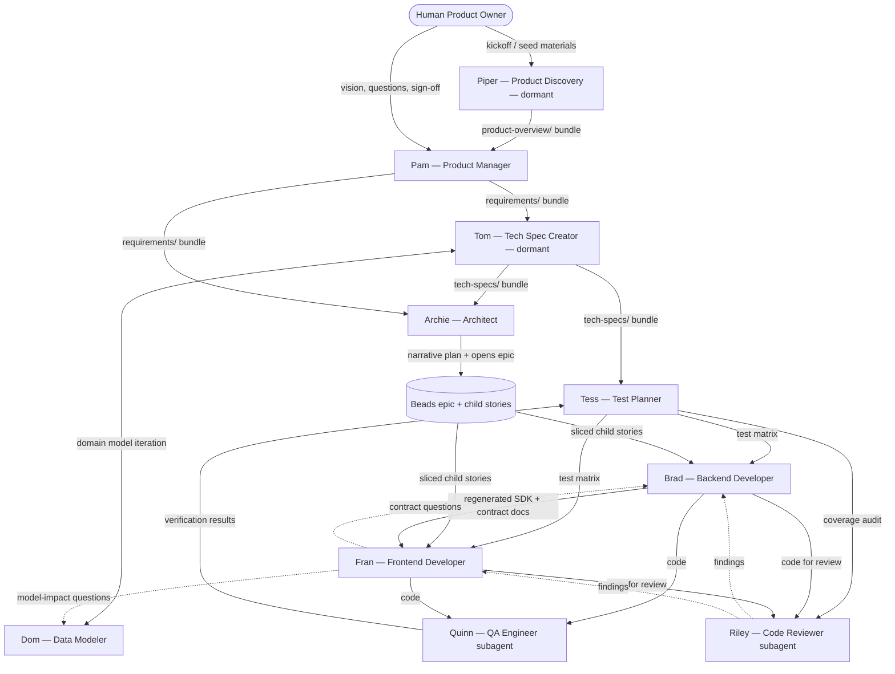
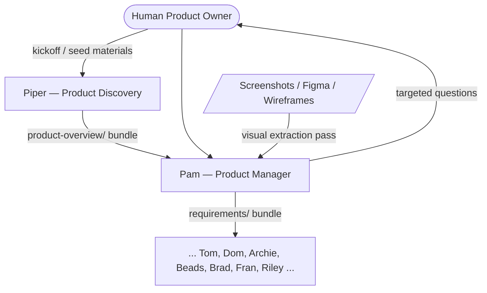
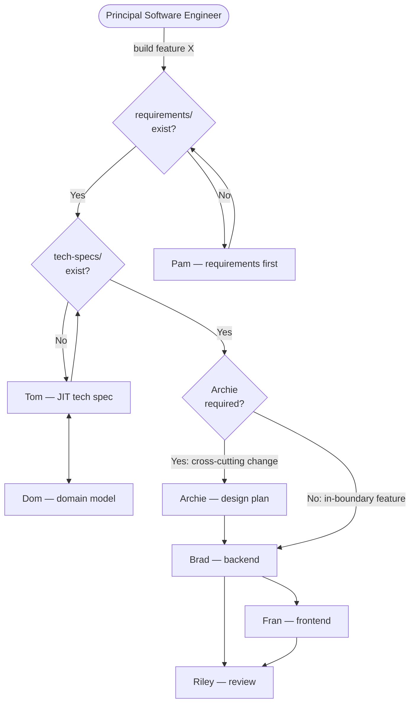

# Persona Flow and Handoffs

This document describes the end-to-end flow through the agent personas, from a product idea to shipped code.

---

## 1. Persona Roster

Authoritative persona playbooks live in `personas/<name>.md`. Tool-specific wrappers in `.claude/skills/`, `.claude/agents/`, `.agents/skills/`, and `.codex/agents/` are thin pointers — they each instruct the model to Read the matching `personas/<name>.md` before acting.

| Persona | Nickname | Status | Scope |
|---|---|---|---|
| Product Discovery | `Piper` | Dormant | Broad product framing, PRD shaping, actor/module identification, discovery handoff. Invoke explicitly for greenfield product or new-module work. |
| Product Manager | `Pam` | Active | Product intent: requirements, use cases, roles, glossary, screens, business rules |
| Technical Specification Creator | `Tom` | Dormant | Pre-implementation tech spec for major new features only; deleted after ship (ADR-0003). Invoke explicitly. |
| Data Modeler | `Dom` | Active | Domain model: entities, fields, constraints, state machines, convention enforcement |
| Architect | `Archie` | Active | Cross-cutting architecture, design plans, infra, ADR authorship |
| Backend Developer | `Brad` | Active | Service, DTOs, mappers, routes, backend tests |
| Frontend Developer | `Fran` | Active | React pages, hooks, components, frontend tests |
| Test Planner | `Tess` | Active | Test case derivation from specs, test matrix, coverage audits |
| QA/Test Engineer | `Quinn` | Subagent | Verification lane selection, test execution, failure triage, release confidence (isolated context, findings report) |
| Code Reviewer | `Riley` | Subagent | Code quality, rule compliance, architectural correctness (isolated context, findings table) |
| Application Spec Builder | `Abe` | Dormant | One-time application-spec extraction from existing implementations; not part of the active flow. Invoke explicitly. |

Formal names remain canonical in plans and rules. Nicknames are shorthand only.

Project task tracking is owned by **Beads** (`.beads/issues.jsonl`, `bd` CLI), not by any persona. Every active feature or major effort maps to a Beads epic; every slice is a child story. See `docs/adr/0001-beads-as-live-task-tracker.md`.

---

## 2. Flow Diagrams

### 2.1 Mode A — Vision Only



Piper and Tom appear in this diagram for completeness. Both are dormant in mature codebases — invoke them explicitly only when the work justifies it (greenfield framing for Piper; pre-implementation tech framing for major new features for Tom). For incremental work, skip directly from Pam to Archie/implementation.

### 2.2 Mode B — Vision Plus Visual Artifacts

Identical to Mode A except Pam performs a visual-extraction pass first, using the artifacts as anchors for `screens.md` and `navigation-and-entry-points.md` before targeted conversation. Piper may still precede Pam if the overall product shape needs framing first.



The rest of the flow is identical to Mode A.

### 2.3 Engineer-Driven JIT Flow

A Principal Software Engineer (PSE) has requirements in hand and wants to go straight to building. Agents auto-sequence the missing phases.



Archie is required for cross-cutting changes (new service, infra, auth, breaking migration); optional for in-boundary features.

---

## 3. Folder Structure

```
project-root/
├── requirements/
│   ├── reference/                             # Seed discovery materials (screenshots, notes)
│   ├── product-overview/                      # Piper's output
│   │   ├── product-overview.md                # Broad product shape and purpose
│   │   ├── prd.md                             # PRD-level summary
│   │   ├── actors.md                          # Primary actors and high-level goals
│   │   ├── module-overview.md                 # Major modules / feature areas
│   │   └── open-questions.md                  # Open discovery questions for Pam
│   └── product-requirements/                  # Pam's output
│       ├── product-requirements.md            # Product purpose, users, non-goals
│       ├── roles-and-actors.md                # Actor definitions, capability matrix
│       ├── glossary.md                        # Canonical terms, UI ↔ model mappings
│       ├── domain-concepts.md                 # Entities, relationships, lifecycle (prose)
│       ├── navigation-and-entry-points.md     # Global nav, entry points, page inventory
│       └── features/
│           └── <feature-slug>/
│               ├── overview.md                # Purpose, actors, capabilities, deferred scope
│               ├── use-cases.md               # Structured use cases with alt/error/acceptance
│               ├── screens.md                 # Screen purposes, roles, actions, states
│               ├── business-rules.md          # Validation, uniqueness, lifecycle, auth rules
│               └── open-questions.md          # Confirmed Drift / Needs Review / Deferred
│
├── tech-specs/                                # Tom's output
│   └── features/
│       └── <feature-slug>/
│           ├── domain-model.md                # Dom: fields table, relationships, state machines
│           ├── api-surface.md                 # Route inventory with roles and errors
│           ├── flows.md                       # Per use case: screen → API → service → DB
│           └── open-questions.md              # Technical ambiguities
│
├── plans/                                     # Narrative-only plan files (Archie)
│   └── <NN>-<feature-area>.md                 # Companion to a Beads epic; deleted on epic close
│
├── .beads/                                    # Beads task tracker
│   └── issues.jsonl                           # Live task state (epics + child stories)
│
├── docs/                                      # Evergreen reference docs
│   ├── PERSONA-FLOW.md                        # This document
│   ├── SESSION-HANDOFF.md                     # Active "resume here" note (updated at session close)
│   ├── DATABASE-SCHEMA.md                     # Archie: target schema reference
│   ├── PROJECT-SETUP.md                       # Developer setup guide
│   └── adr/                                   # Architecture Decision Records (immutable)
│
├── personas/                                  # Authoritative persona playbooks
│   ├── piper.md                               # Piper (dormant)
│   ├── pam.md                                 # Pam
│   ├── tom.md                                 # Tom (dormant)
│   ├── dom.md                                 # Dom
│   ├── archie.md                              # Archie
│   ├── brad.md                                # Brad
│   ├── fran.md                                # Fran
│   ├── tess.md                                # Tess
│   ├── quinn.md                               # Quinn (subagent body)
│   ├── riley.md                               # Riley (subagent body)
│   └── abe.md                                 # Abe (dormant, one-time spec extraction)
│
├── .claude/                                   # Claude Code thin-pointer wrappers → personas/
│   ├── skills/<name>/SKILL.md                 # Active + dormant personas as Claude skills
│   └── agents/<name>.md                       # Quinn, Riley as Claude subagents
│
├── .agents/                                   # Codex thin-pointer wrappers → personas/
│   └── skills/<name>/SKILL.md                 # Active + dormant personas as Codex skills
│       (dormant skills include agents/openai.yaml with allow_implicit_invocation: false)
│
├── .codex/                                    # Codex subagent definitions
│   └── agents/<name>.toml                     # Quinn, Riley as Codex subagents
│
├── rules/                                     # Canonical rules
│   ├── workflow-rules.md
│   ├── working-style.md
│   ├── product-discovery-rules.md
│   ├── product-requirements-rules.md
│   ├── technical-specification-rules.md
│   ├── architecture-rules.md
│   ├── service-rules.md
│   ├── react-ui-rules.md
│   ├── ux-rules.md
│   ├── testing-rules.md
│   ├── model-change-rules.md
│   └── domain-model-conventions-rules.md
│
├── packages/                                  # Backend implementation
├── clients/                                   # Frontend implementation
├── tests/                                     # Test suites
└── infrastructure/                            # Docker, Terraform, CI/CD
```

---

## 4. Per-Persona Role, Inputs, Outputs

### 4.0 Piper — Product Discovery

- **Role:** Frame the product broadly before Pam begins detailed requirements work.
- **Inputs:**
  - Owner's kickoff prompt or rough idea.
  - (Mode B) seed materials in `requirements/reference/` — screenshots, notes, rough docs.
- **Outputs** (`requirements/product-overview/`):
  - `product-overview.md`, `prd.md`, `actors.md`, `module-overview.md`, `open-questions.md`.
- **Handoff criteria:** product purpose clear; primary actors identified; major modules/feature areas named; key constraints captured; open questions listed.
- **Does not produce:** detailed use cases, screen-by-screen flows, schema, API contracts, implementation plans.

### 4.1 Pam — Product Manager

- **Role:** Iteratively define product intent with the human owner.
- **Inputs:**
  - Owner's vision and domain knowledge.
  - Piper's `requirements/product-overview/` bundle when discovery has already run.
  - (Mode B) visual artifacts — screenshots, wireframes, Figma frames.
- **Outputs** (`requirements/product-requirements/`):
  - Product-level: `product-requirements.md`, `roles-and-actors.md`, `glossary.md`, `domain-concepts.md`, `navigation-and-entry-points.md`.
  - Per feature (`features/<feature-slug>/`): `overview.md`, `use-cases.md`, `screens.md`, `business-rules.md`, `open-questions.md`.
- **Use case template:** Actor, Goal, Confidence label, Preconditions, Normal flow, Alternate flows, Error paths, Postconditions, Acceptance criteria, Business rules referenced.
- **Confidence labels:** `(Confirmed)` / `(Inferred)` / `(Needs Review)` on every use case, screen, and business rule.
- **Handoff criteria:** all files exist; every item labeled; no unclassified open questions; owner signed off end-to-end; cross-feature references linked.
- **Does not produce:** schema, routes, DTOs, field-level types/constraints, state machines, architecture decisions.

### 4.2 Tom — Technical Specification Creator

- **Role:** Convert Pam's owner-confirmed requirements into a feature-level technical specification by orchestrating Dom.
- **Inputs:**
  - Pam's complete `requirements/` bundle with owner sign-off.
  - `rules/domain-model-conventions-rules.md`.
- **Outputs** (`tech-specs/features/<feature-slug>/`):
  - `domain-model.md` (owned by Dom, reviewed by Tom) — fields table, relationships, state machines, invariants.
  - `api-surface.md` — route inventory with method, route, purpose, request/response DTOs, allowed roles, notable errors.
  - `flows.md` — per use case: trigger, screen → API → service → persistence sequence, error branches, state transitions.
  - `open-questions.md`.
- **JIT invocation:** triggered automatically when requirements exist but tech-specs don't.
- **Handoff criteria:** every Pam use case has a corresponding flow; every route has roles + errors; every entity has a fields table; `open-questions.md` is empty; naming matches Pam's glossary.
- **Does not produce:** product decisions, architecture decisions, implementation code.

### 4.3 Dom — Data Modeler

- **Role:** Formalize the domain model and enforce conventions from `rules/domain-model-conventions-rules.md`.
- **Inputs:**
  - Pam's `domain-concepts.md` and `business-rules.md`.
  - Tom's request for a technical domain model.
- **Outputs:**
  - `tech-specs/features/<feature>/domain-model.md` (as Tom's subagent during greenfield).
  - Mid-implementation impact classification (UI-only / contract-only / real model change).
- **Handoff criteria:** every entity has a fields table (`name | type | nullable | default | constraints`), relationships with cardinality and cascades, and state machines for lifecycle fields.

### 4.4 Archie — Architect

- **Role:** Cross-cutting architecture decisions, design plans, execution planning, CI/CD, deployment, infrastructure.
- **Inputs:**
  - Pam's `requirements/`.
  - Tom's `tech-specs/`.
- **Outputs:**
  - `plans/<NN>-<feature>.md` — narrative-only design plan paired with a Beads epic. Carries Key Decisions, Data Model Changes, API Surface, Dependencies, Deferred. **No task tables** — slice list lives in Beads.
  - A Beads epic with child stories (one per slice), opened at planning time.
  - `docs/DATABASE-SCHEMA.md` — target schema reference.
  - `docs/adr/<NNNN>-<title>.md` — for any cross-cutting decisions captured during the plan that should outlive the slice.
- **Conditional invocation:** required for cross-cutting changes (new service, infra, auth, breaking migration); optional for in-boundary features.
- **Handoff criteria:** every Beads child story is committable and validatable on its own; dependencies declared; design plan references the use cases it implements; durable patterns captured as ADRs *before* the plan is deleted on epic close.

### 4.6 Brad — Backend Developer

- **Role:** Implement service-layer code against design plans and use cases.
- **Inputs:**
  - Assigned plan row.
  - Tom's `tech-specs/features/<feature>/` files.
  - Rules: service, testing, model-change, workflow.
- **Outputs:**
  - Prisma schema + migration; service/repo logic; Zod DTOs; mappers; Fastify route schemas; regenerated OpenAPI/SDK.
  - Unit, DB-integration, and SDK functional-API tests.
  - Contract documentation inline in DTOs and route descriptions.
  - Plan row update.
  - *(future)* Slice summary, contract examples, migration runbooks, feature-flag and runbook updates.
- **Handoff criteria:** slice-completion checklist and contract-documentation checklist satisfied; SDK regenerated and exported before Fran consumes it.

### 4.7 Fran — Frontend Developer

- **Role:** Build the web application against the generated SDK and the reviewed plans/use cases.
- **Inputs:**
  - Assigned plan row.
  - Generated SDK and types from Brad.
  - Pam's `use-cases.md` and `screens.md`.
  - Rules: react-ui, ux, testing.
- **Outputs:**
  - React pages, components, and hooks.
  - Vitest unit tests and MSW-backed integration tests.
  - Loading/error/empty/success state handling.
  - Stable `data-testid` selectors.
  - Plan row update.
  - *(future)* Slice summary, contract-question artifacts, frontend registry updates.
- **Handoff criteria:** does not begin until the SDK/types for the slice actually exist; frontend review checklist satisfied.

### 4.8 Tess — Test Planner

- **Role:** Derive test cases from product requirements and technical specifications. Produce a test matrix. Audit coverage after implementation.
- **Inputs:**
  - Pam's `use-cases.md`, `screens.md`, `business-rules.md`.
  - Tom's `api-surface.md`, `flows.md`.
- **Outputs:**
  - `tech-specs/features/<feature>/test-matrix.md` — derived test cases with layer, scenario, positive/negative, and coverage status.
  - Coverage audit findings table after implementation (uses Quinn's verification results to update matrix).
- **Handoff criteria:** test matrix derived before or alongside implementation; coverage audit completed before Riley's code review.
- **Does not produce:** tests, test execution, production code, product decisions.

### 4.9 Quinn — QA/Test Engineer

- **Role:** Verification strategy, test execution, failure triage, test infrastructure health, release confidence.
- **Inputs:**
  - Tess's test matrix (when available).
  - Implemented code from Brad and Fran.
  - Slice risk profile.
- **Outputs:**
  - Verification results: what ran, what passed, what was blocked.
  - Failure triage: product regression vs stale test vs environment issue.
  - Test infrastructure health findings (stale factories, mocks, helpers).
  - Release confidence report with residual risk.
- **Handoff criteria:** verification lanes selected based on slice risk; failures triaged; residual risk surfaced; test infrastructure swept after model/contract changes.
- **Does not produce:** test cases from specs (Tess does that), production code, code quality review.

### 4.10 Riley — Code Reviewer

- **Role:** Audit implementation against rules, plans, and use cases.
- **Inputs:**
  - Slice under review.
  - Corresponding plan row and use cases.
  - Rules applicable to the changed modules.
- **Outputs:**
  - Findings table with severity, category, and file references.
  - Explicit merge recommendation or block.
  - *(future)* Handoff-completeness review.
- **Handoff criteria:** every finding is either resolved or explicitly accepted with rationale.

---

## 5. Handoff Criteria Summary Table

| From | To | Bundle | Gate |
|---|---|---|---|
| Owner | Piper | Kickoff prompt, seed materials | Conversation started |
| Piper | Pam | `requirements/product-overview/` bundle | Product shape clear; actors named; modules identified; open questions listed |
| Owner | Pam | Vision, visuals (Mode B) | Conversation started |
| Pam | Tom | `requirements/` bundle | All items labeled; owner signed off; `open-questions.md` classified |
| Tom | Archie | `tech-specs/` bundle | Every use case mapped to flows; every route has roles + errors; domain model complete |
| Tom | Brad / Fran | `tech-specs/features/<feature>/*` | Same gate as Tom → Archie, scoped to the feature |
| Archie | Beads | Narrative `plans/<NN>-*.md` + Beads epic with child stories | Plan present; epic open; child stories enumerated; dependencies declared in Beads; design decisions documented |
| Beads | Brad / Fran | Beads child story | Story open and assigned; slice independently committable |
| Brad | Fran | Regenerated SDK + contract docs | SDK exported; contract-documentation checklist satisfied |
| Fran | Brad | Contract question | Cites what docs say; proposes doc addition |
| Tom | Tess | `tech-specs/` bundle | Tech spec complete; Tess derives test matrix |
| Tess | Brad / Fran | Test matrix | Test cases derived from specs; developers know what to test |
| Brad / Fran | Quinn | Code + tests for verification | Quinn selects lanes, runs, triages failures |
| Quinn | Tess | Verification results | Tess updates matrix coverage status |
| Tess | Riley | Coverage audit | Test gaps flagged; coverage verified |
| Brad / Fran | Riley | Code for review | Slice-completion checklist satisfied |
| Riley | Brad / Fran | Findings table | Each finding resolved or explicitly accepted |

---

## 6. Escalation and Ambiguity Routing

- **Product framing question** (what is this product, who are the users, what are the modules) → `Piper` for new/vague products; `Pam` once the shape is known.
- **Product question** (what should this do, who can do it, why) → `Pam`.
- **Technical contract question** (endpoint shape, schema, state machine) → `Tom` during spec; `Brad` during and after implementation.
- **Implementation question** (how to build in the stack) → `Brad` / `Fran` / `Archie` by layer.
- **Model-impact classification** (does this change the domain model?) → `Dom`.
- **Test planning question** (what test cases does this use case need?) → `Tess`.
- **Test execution question** (which lanes to run, is this failure real or stale?) → `Quinn`.
- *(future)* **Operational question** (how does this run in prod) → `Archie` primarily.
- *(future)* **Handoff gap** (doc missing, runbook missing) → `Riley` flags; originating persona fixes.

---

## 7. Cross-Cutting Artifacts

| Artifact | Owner | Status |
|---|---|---|
| `requirements/product-overview/` | Piper | Active — discovery inputs for Pam |
| `requirements/` | Pam | Active — canonical product requirements |
| `tech-specs/` | Tom + Dom | Pre-implementation only — deleted after ship (ADR-0003) |
| `plans/` | Archie | Narrative companion to a Beads epic — deleted on epic close (ADR-0002) |
| `.beads/issues.jsonl` | All | Active — canonical task tracker (ADR-0001) |
| `personas/` | All persona owners | Active — authoritative persona playbooks |
| `docs/adr/` | Archie | Active — immutable cross-cutting decisions |
| `docs/SESSION-HANDOFF.md` | All | Active — updated at session close; read at session resume |
| `docs/DATABASE-SCHEMA.md` | Archie | Active |
| `docs/ARCHITECTURE.md` | Archie | *(future)* |
| `docs/INFRASTRUCTURE.md` | Archie | *(future)* |
| `docs/FEATURE-FLAGS.md` | Brad | *(future)* |
| `docs/RUNBOOKS/` | Brad | *(future)* |
| `CHANGELOG.md` | Archie or Riley | *(future)* |

---

## 8. What's Active Now vs What's Next

**Active:**

- Beads (`.beads/issues.jsonl`, `bd` CLI) is the canonical live task tracker (ADR-0001).
- Pam produces the full requirements bundle with confidence labels, use-case template, Mode A/B, and handoff floor.
- Dom owns domain modeling and contract-impact classification.
- Archie produces narrative `plans/<NN>-*.md` paired with a Beads epic, and writes ADRs in `docs/adr/` for durable cross-cutting decisions.
- Brad, Fran, Tess, Quinn (subagent), and Riley (subagent) operate per their current persona playbooks under `personas/`.

**Dormant / explicit-invocation only:**

- Piper — invoke for greenfield product or new-module framing.
- Tom — invoke pre-implementation for major new features only; tech specs deleted after ship (ADR-0003).
- Abe — one-time application-spec extraction from existing implementations.

**Future:**

- Archie current-state docs (`docs/ARCHITECTURE.md`, `docs/INFRASTRUCTURE.md`).
- Brad slice summaries, contract examples, migration runbooks, feature-flag inventory, and operational runbooks.
- Fran contract-question format, slice summary, and frontend registries.
